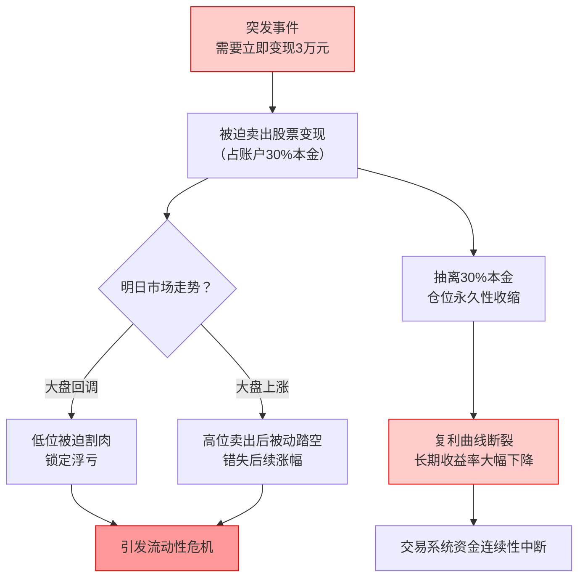

> 亲情重要吗？重要也不重要。金钱重要吗？重要也不重要。
无论你的交易系统多么精密，平静似水（Be Water），才是抵抗人生无常的终极杠杆。

## 0x0 引言

投资圈有一句被嚼烂的话："交易反人性"。

通常认为，**反人性是指由于贪婪和恐惧而无法拿住股票**。但最近发生的一件事让我意识到，对于我们这些试图通过交易改变命运的普通人而言，真正的"反人性"在于：

> **理性的复利曲线，可能无法兼容感性的人类生活。**

当我自以为建立了一套完美的交易系统，正准备依靠时间杠杆撬动财富自由时，一通突如其来的电话让我意识到：阻碍普通人跨越阶层的，往往不是选股能力，而是生活中无处不在的 **"系统性硬耦"** 。

## 0x1 本金即安全感

今天父亲打来电话，这很罕见。
事情很老套：**他背着母亲借钱给别人赚利息，现在为了平息家庭矛盾，需要我支援3万块填坑。甚至为了让我放心，还发来了借条。**

理性上，我知道这钱大概率不会丢，只是左口袋进右口袋。但在我的**财务逻辑**里，这是一场灾难。这3万块不是躺在银行卡里的闲钱，它是我交易系统里的核心燃料（Capital）。

对于一个满仓者，我明天就要被迫卖出股票变现，这就是一场典型的**流动性危机**（Liquidity Crisis）：

> [!danger]
> - 如果明天大盘回调，我就是被迫割肉。
> - 如果明天大盘上涨，我就是被动踏空。

更致命的是，这3万块代表了我当前**投资账户 30% 的本金**。

抽离30%的本金，意味着我的复利模型瞬间坍塌。普通人建立交易系统最难的不是技术，而是**资金的连续性**。

只有当一个人对未来有绝对确定的安全感时，他才敢定投；

但这通电话，精准地击碎了这种确定性。这是一个恶性循环：你越需要安全感，你越努力积累；但生活越是会在你积累的关键时刻，通过"亲情"或"意外"来收割你的安全感。

点击查看【资金链断裂推演图】

## 0x2 消费的隐形损耗

这种无力感不仅来自突发事件，更来自日常的**财务熵增**。

自诩在一线城市拿着高薪，过着低欲望生活，我以为2025年的积蓄会是一条漂亮的指数增长曲线。**但看着账户余额，我沉默了。**

虽然没有买车买房的大额支出，但每个月总有莫名其妙的"不可抗力"：**_一次朋友聚餐，一场突发的感冒，一件不得不换的电器。_** 这些看似微不足道的支出，就像船底的藤壶，悄无声息地吞噬着船速。

我们总是高估了自己的规划能力，低估了生活的混乱程度：

- 买房、结婚、生子是**计划内的回撤**；
- 而意外、疾病、甚至父亲的一通电话，是**计划外的崩盘**。

痛苦的根源在于：我们将**生活系统**和**投资系统**发生了**硬耦合（Hard Coupling）**。只要生活一震动，投资系统就崩塌。

## 0x3 建立三级缓冲

既然无法预测意外，我们必须在系统层面进行**解耦（Decoupling）**。

现在的我，钱只有两种状态："花的"和"投的"。这太脆弱了。我需要建立一套物理隔离的**三级资金池**，作为防御生活撞击的防波堤：

建立三级资金池（点击查看）

### 1. 一级蓄水池（生存金）
- **【定义】**：3-6个月的生活费（绝对现金，放余额宝/货币基金）。
- **【作用】**：应付日常开销、房租、随份子。
- **【铁律】**：这个池子不满，绝对不向上一级输送资金。

### 2. 二级防波堤（反脆弱基金）
这是我，也是大多数年轻人最缺失的一环。
- **【定义】**：设定一个"麻烦阈值"，例如 3万-5万元。
- **【作用】**：专门应对家庭矛盾、突发疾病、意外事故等"计划外崩盘"。
- **【铁律】**：这个池子不动，投资账户的仓位永远不能满仓。

### 3. 三级投资池（可损失资本）
- **【定义】**：真正用于投资的资金，即使全部损失也不影响生活。
- **【作用】**：这是你唯一可以用来"赌"的钱，可以承受100%的损失。
- **【铁律】**：永远不用杠杆，永远不做超出风险承受能力的投资。

## 0x4 结语

投资最难的不是技术分析，不是情绪控制，而是**建立系统性的财务隔离**。

当你的投资资金真正成为"可损失资本"时，你才能做到：
- 不因为家庭突发用钱而被迫割肉
- 不因为市场波动而影响生活
- 不因为短期回撤而破坏长期复利

**真正的投资自由，不是赚多少钱，而是让你的投资系统和生活系统彻底解耦。**

只有这样，理性的复利曲线，才能兼容感性的人类生活。
