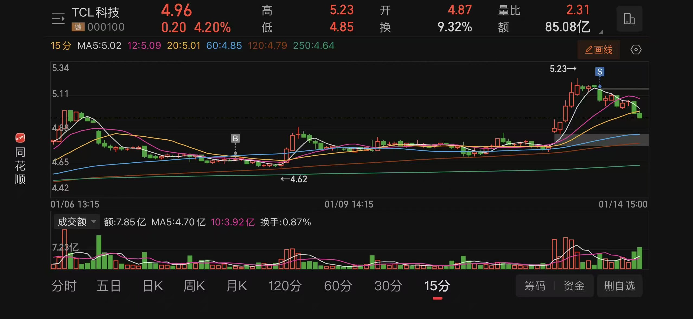
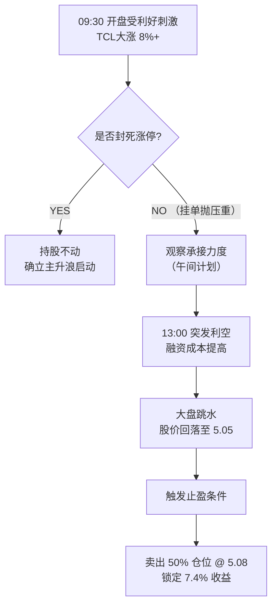
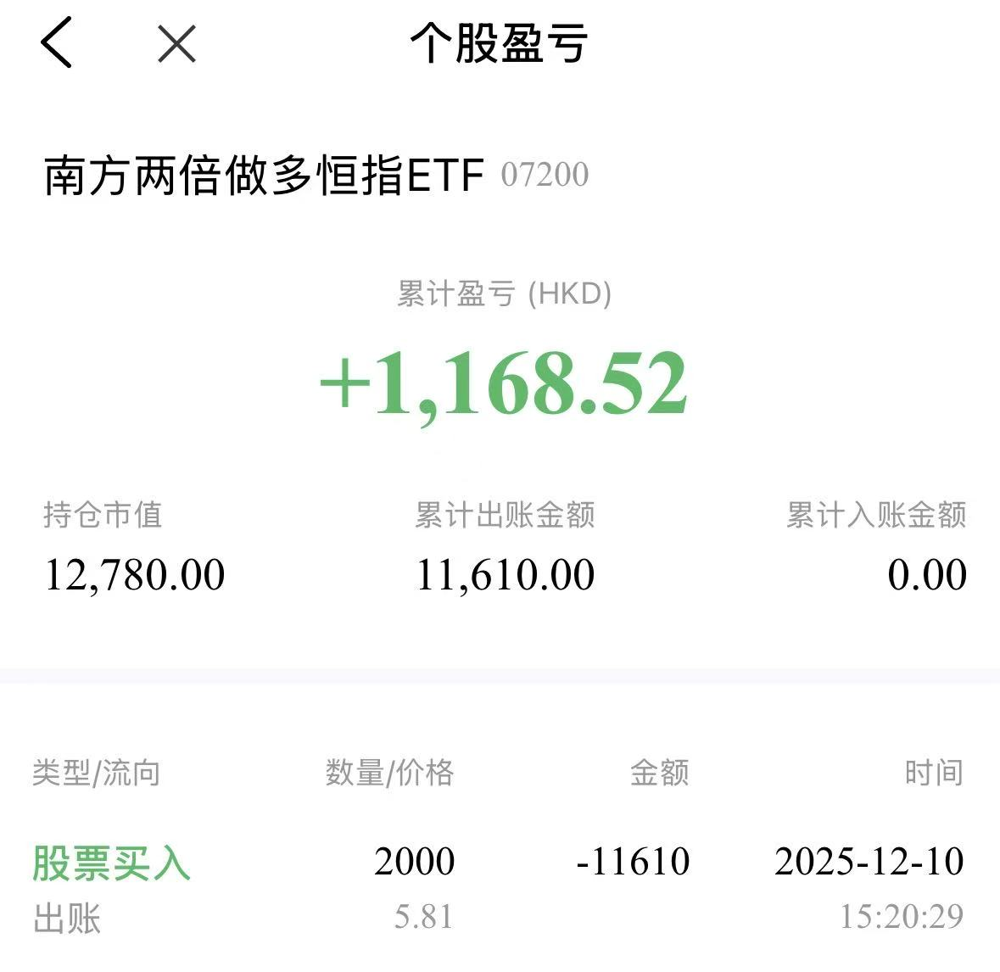

> 市场永远在预支未来。当所有人都在为确定的过去（财报）欢呼时，交易者必须盯着不确定的当下（盘口）。

## 0x0 多巴胺与冷水澡

今天上午的开盘，是一场典型的**多巴胺盛宴**。

TCL科技（000100）高开高走，一度飙升近 **9%**。我看着屏幕上红得发紫的数字，以及几天前刚刚接回的筹码瞬间浮盈 **7.4%**，这种“精准抄底+利好暴击”的剧本，足以让任何投资者的肾上腺素飙升。

**催化剂是一份漂亮的成绩单：** 昨晚公告显示，2025年企业营收预期强劲，TCL华星净利润超80亿元。

这是一个绝对的基本面利好。按理说，我应该躺在功劳簿上数钱。但在午饭时间的短暂兴奋后，我的直觉（以及那该死的经验）开始泼冷水：

1. **利好出尽即利空**：股价已经在早盘反应了这一消息，但迟迟未能封死涨停。
2. **盘口语言**：涨停价位上挂着巨量的卖单，说明有大资金借着利好在“派发”。
3. **似曾相识**：这种“冲高回落”的剧本，上一周才刚刚上演。

下午，A股突然传出“收紧保证金”的利空消息，大盘跳水。早盘的犹豫变成了下午的决绝——**我按下了卖出键。**

---

## 0x1 TCL科技：从预期到落袋

这是一次教科书式的**预期管理**操作。

**复盘逻辑链：**

- **买入点**：5天前（1月9日），在上一轮家庭变故后的理性回归，此时是基于技术面超跌的博弈。
- **爆发点**：今天（1月14日），基于基本面消息（80亿利润）的情绪宣泄。
- **卖出点**：下午盘中，价格跌破 5.08 RMB。

我选择了**止盈 50%**。

> **为什么不全卖？**  
> 因为趋势尚未完全坏死，保留底仓是防止踏空后续的“主升浪”。  
>
> **为什么不全留？**  
> 因为未能封板就是弱势表现，叠加下午的宏观利空，必须锁定这 7.4% 的利润，防止“过山车”惨剧。

### 日内交易决策树

这也印证了我一直以来的观点：

> 由于我们无法预知下午会有什么利空，所以当上午市场给出了溢价时，先拿走一部分属于你的钱，永远没错。

> [!IMPORTANT]只要赚钱了，就不臭。

---

## 0x2 恒生指数：杠杆是时间的敌人

如果说TCL的操作是战术层面的“止盈”，那么下午清仓**两倍做多恒生指数**，则是战略层面的**降维**。

这笔交易同样盈利颇丰，从底部反弹已获利 10%+。但我清仓的核心逻辑并非因为它涨不动了，而是因为**时间成本**。

在融资账户里，杠杆是有隐形税收的。年化 8% 的融资成本，意味着：

- 如果市场横盘，我在亏钱。
- 如果市场微涨，我只是打平。
- 只有市场大涨，我才能跑赢成本。

### 清仓逻辑审计

#### 1. 阻力位确认
- 恒指已经反弹至前期高点（箱体上沿），大概率进入震荡消化期。

#### 2. 摩擦成本（Friction Cost）
- 在震荡市中持有杠杆是低效的。
- 时间是杠杆的敌人，却是现金的朋友。
- 为了不确定的鱼尾行情，支付确定的利息成本，并不划算。

#### 3. 宏观共振
- A股融资成本提高，本质上是流动性收紧。
- 港股对流动性高度敏感，风险同步放大。

---

## 0x3 美股的犹豫与“空仓的智慧”

现在，压力来到了美股账户。

逻辑上，我也希望降低美股杠杆。目前美股处于一个**高位箱体震荡区间**：

- **看多**：似乎随时可能突破前高
- **看空**：处于上沿，盈亏比很差，且高利率压制明显

这种**不上不下的状态**，是最容易犯错的阶段。

因此我的选择是：

> **先观察，不急于行动。**

在方向不明确时：

- 不强行交易  
- 不预设立场  
- 不消耗子弹  

与其被震荡来回收割，不如等待确定性。

---

## 0x4 总结：此时此刻，现金为王

今天的核心策略可以用一个词概括：

> **收缩**

1. **TCL科技**：借利好减仓，锁定收益  
2. **恒生指数**：借高点去杠杆，降低风险  
3. **整体策略**：从进攻转向防守  

---

> 投资不是比谁在顺风局赚得多，而是比谁在逆风局活得久。

当市场开始出现这些信号：

- 利好无法封板  
- 流动性收紧  
- 高位震荡  

其实已经在提醒你：

> **“风可能要停了。”**

今天的我，虽然仓位减少了一些，但换来的是：

**更好的风险控制，以及一晚踏实的睡眠。**
