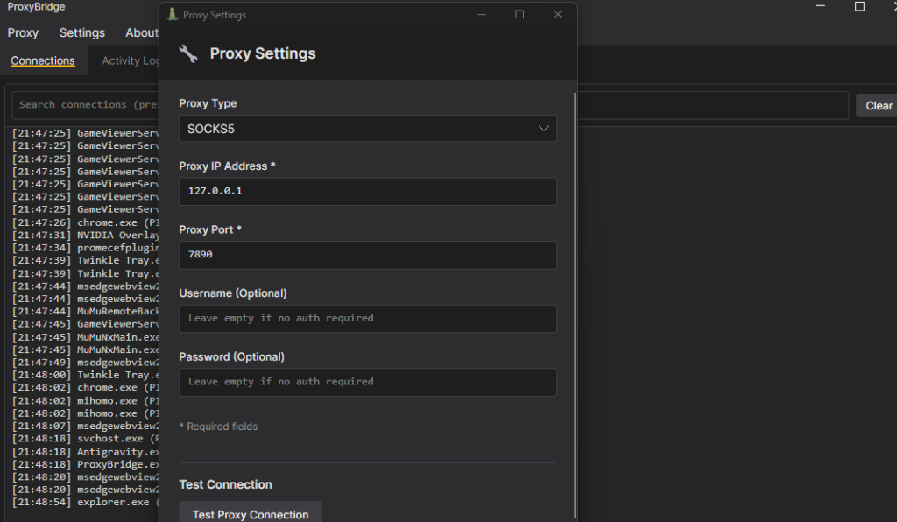
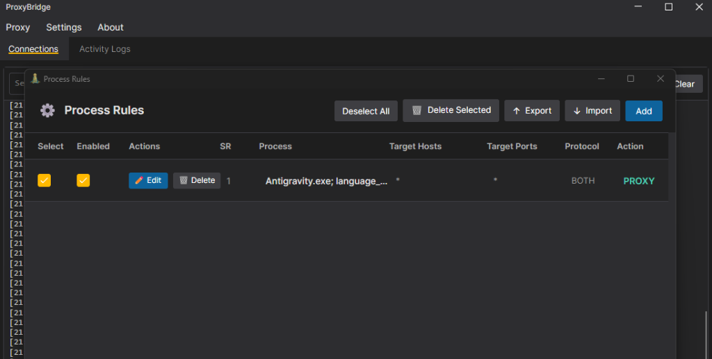

## 0x0 引言

有很多同学在使用 Antigravity 时，会发现自己无论如何都无法登录，尤其是在梯子网络环境下的朋友。

今天分享两个亲测有效的方法，帮你彻底解决这个烦恼。

## 0x1 方法一：开启代理软件的 TUN 模式

如果你的代理软件使用的是 **Clash**，需要在设置中开启它的 **TUN 模式**（即虚拟网卡模式），并且要点击安装服务/网卡。

如果你使用的是其他代理软件，同样需要找到并开启“虚拟网卡”或“TUN 模式”功能，然后打开系统代理，从而让代理软件接管所有的网络请求。

在完成这两个操作之后，你可以使用 **[Gravity Tools](https://github.com/lbjlaq/Antigravity-Manager)** 这个辅助软件来进行账号管理。就算你直接登录有困难，也可以在这个软件里进行账号切换，从而实现曲线登录。

## 0x2 方法二：使用 Proxy Bridge 强制代理（推荐）

在最近的一段时间，我发现上面那个方法有时会失效。因此我教你下面这个更彻底的方法。

这个方法的核心是下载 **Proxy Bridge** 软件，并在其中为 `Antigravity.exe ` 程序强制设置代理。具体操作步骤如下：

### 第一步：下载并安装软件
首先下载 Proxy Bridge。这是一个开源项目，安全可靠，可以放心安装使用。
👉 [点击获取 Proxy Bridge 下载链接](https://github.com/InterceptSuite/ProxyBridge/releases)

### 第二步：设置本地代理
打开软件，点击左上角的 `Proxy`，选择 `Proxy Settings`。
将代理设置为你的本地代理，例如 `127.0.0.1:7890`。
> **注意：** 此处的端口号（如 7890）必须与你正在使用的代理软件的本地监听端口号完全一致。

### 第三步：添加代理规则
点击左上角的 `Proxy`，选择 `Process Rules`，然后点击 `Add` 添加新规则。

在弹出的窗口中，将以下两个程序添加进去：
* `Antigravity.exe`
* `language_server_windows_x64.exe`

然后，将它们的网络协议设置为 **UDP 和 TCP 都使用代理**。

---

全部设置完成之后，重新打开并登录 Antigravity 就可以成功连上了。被登录问题困扰的同学，快去试一下吧！
