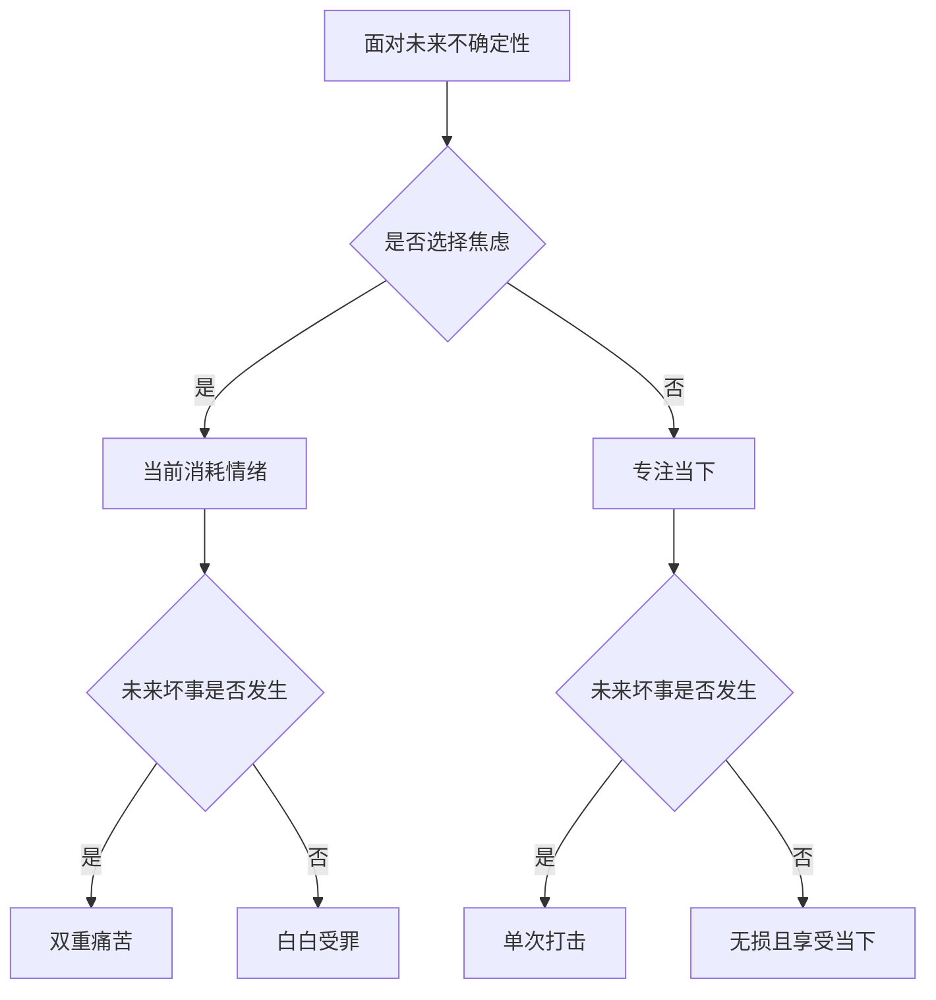
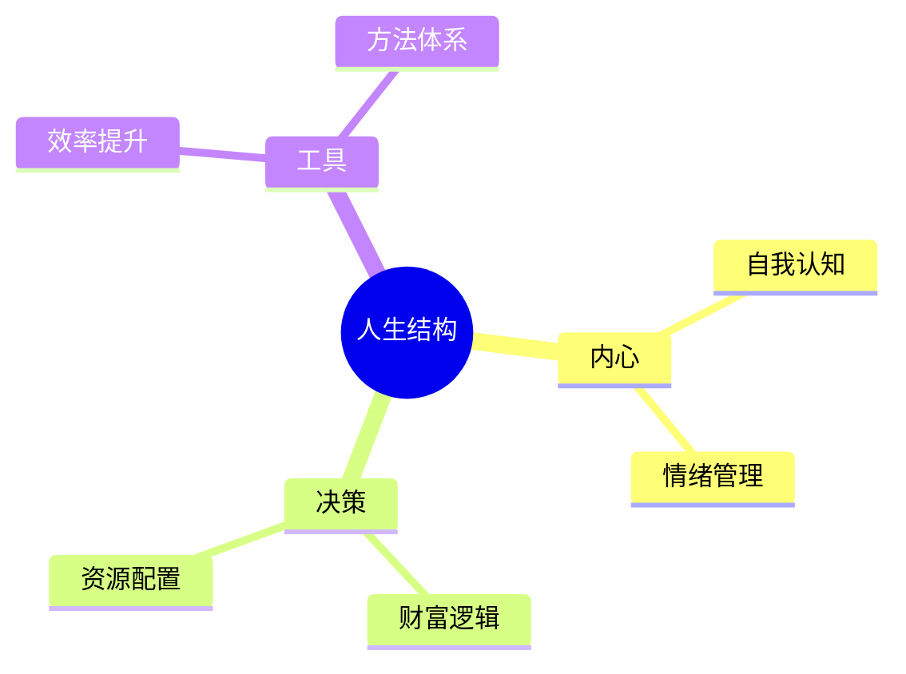

## 0x0 在“罗马”与“洞穴”之间

**我曾一直在寻找一种理想的生活方式：**

> 不必为了金钱委曲求全，不必迎合他人情绪，也不必为未知的未来持续焦虑。

这似乎是许多二十多岁年轻人共同的状态。

我们羡慕那些“出生在罗马”的人，却忽略了自己并非身处绝境；我们羡慕他人的从容，却在深夜反复咀嚼自己的不安。

为了追逐“财富自由”，我曾在喧嚣中把自己困进一座孤独的“洞穴”。

我告诉自己，这一切都是为了家人、为了未来。但在无数个难眠的夜晚之后，我开始反问：

**这一切，真的值得吗？**

---

## 0x1 那些被美化为“未雨绸缪”的焦虑

过去几年里，我最大的精神消耗，其实只有一个来源：**钱**。

尽管当前的积蓄足够维持生活，但大脑总是不自觉地跳到未来：

- 如果失业了怎么办？
- 如果家人生病了怎么办？
- 如果经济出现问题怎么办？

我曾把这种思考称为“未雨绸缪”，以为这代表成熟。

但后来我意识到，这其实是一种低效甚至荒谬的思维方式，可以总结为：

> **提前承受本不确定的痛苦。**

### 提前焦虑的逻辑

未来确实可能发生糟糕的事情，但如果你现在就因为这种可能性而陷入痛苦，那么：

- 你没有降低风险
- 却提前消耗了情绪

**等于把痛苦体验了两次。**

### 逻辑结构如下：

**结论很直接：**

焦虑不会改变结果，只会降低你当下的生活质量。

即便未来真的出现问题，也不值得用今天的情绪去提前支付代价。

---

## 0x2 人生更像一场“体验”

当把视角拉远，从更宏观的角度来看：

所谓的成功与失败，其实只是不同的体验路径。

- 富裕是一种体验  
- 贫穷也是一种体验  
- 有权有势是一种剧本  
- 默默无闻也是一种剧本  

**它们本质上没有绝对的优劣之分。**

> 它们只是不同的“人生版本”。

### 我的核心想法

- **不执着于世俗标准**
  - 即使过程坎坷，只要真实体验过，就是有价值的
- **记录本身就是意义**
  - 不为了观众或回报，仅仅为了梳理与回看

与其执着终点，不如认真走路。

---

## 0x3 如何活得更清醒

> 有时候，让人痛苦的不是问题本身，而是对问题的反复放大。

为了减少这种无效内耗，我决定构建一个长期输出的平台。

它不是情绪宣泄的地方，而更像一个：

> **理性与感性交汇的实验场**

我把自己的探索分为三个方向：

### 1. 我是谁（内心探索）
- 心理学与自我认知
- 情绪与价值观的重建  
**目标：建立稳定的内在结构**

### 2. 我如何活（决策与投资）
- 财富观念与资源配置
- 投资逻辑与现实选择  
**目标：提升选择自由度**

### 3. 我如何活得更好（工具与效率）
- 软件工具与方法论
- 技术带来的效率提升  
**目标：释放时间用于真正重要的事情**

### 三者关系

---

## 0x4 写给自己，也写给你

这可能不是一个热闹的地方，也未必会有多少人关注。

但记录本身，就已经有意义。

如果这些内容能在某个时刻：

- 帮你理清思路  
- 或者缓解一丝焦虑  

那就已经足够。

---

> 下次当你再次陷入对未来的焦虑时，可以问自己一句：

**“我是不是在提前承受不必要的痛苦？”**

如果答案是“是”，那就：

- 回到当下  
- 做一件具体的小事  
- 或者 simply 去感受此刻  

---

**欢迎来到这里。**

我们一起，在这个复杂的世界里，尽量活得清醒一点。